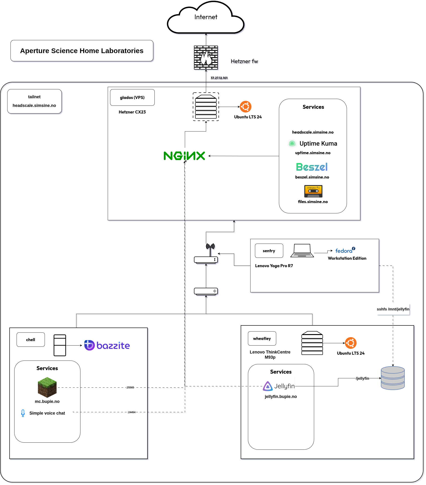

# Homelab public mirror

```
|---------------- Welcome to -------------------|
|      Aperture Science Home Laboratories       |
|-----------------------------------------------|
|                 .,-:;//;:=,                   |
|             . :H@@@MM@M#H/.,+%;,              |
|           ,/X+ +M@@M@MM%=,-%HMMM@X/,          |
|         -+@MM; $M@@MH+-,;XMMMM@MMMM@+-        |
|       ;@M@@M- XM@X;. -+XXXXXHHH@M@M#@/.       |
|     ,%MM@@MH ,@%=            .---=-=:=,.      |
|     =@#@@@MX .,              -%HX$$%%%+;      |
|     =-./@M@M$                  .;@MMMM@MM:    |
|     X@/ -$MM/                    .+MM@@@M$    |
|   ,@M@H: :@:                    . =X#@@@@-    |
|   ,@@@MMX, .                    /H- ;@M@M=    |
|   .H@@@@M@+,                    %MM+..%#$.    |
|     /MMMM@MMH/.                  XM@MH; =;    |
|     /%+%$XHH@$=              , .H@@@@MX,      |
|       .=--------.           -%H.,@@@@@MX,     |
|       .%MM@@@HHHXX$$$%+= .:$MMX =M@@MM%.      |
|         =XMMM@MM@MM#H;,-+HMM@M+ /MMMX=        |
|           =%@M@M#@$-.=$@MM@@@M; %M%=          |
|             ,:+$+-,/H#MMMMMMM@= =,            |
|                   =++%%%%+/:-.                |
|-----------------------------------------------|
```

Public mirror of aperture science home laboratories, my personal homelab setup. Some private files are excluded and git history is separate.

## Thematics

The setup is themed around the portal universe created by Valve Software where nodes are named after [characters from said universe](https://web.archive.org/web/20250815063639/https://theportalwiki.com/wiki/Characters)

## Technical overview

Nodes in the setup consist of Virtual Private Server *(VPS)* instances, stationary computers and portable devices.

The following technical diagram illustrates the top level structure and can be edited with [draw.io](https://app.diagrams.net/)



## Ansible

First create a sudo password file and vault key file

```bash
nano ./ansible/.ansible_sudo_password
```

```bash
nano ./ansible/.ansible_vault_key
```

Then setup Ansible by installing the required dependencies using the following script

```bash
./setup_ansible.sh
```

To run Ansible configurations

```bash
./run_config.sh
```

To run Ansible host updates

```bash
./run_update.sh
```

To update the secret Ansbile group variables

```bash
./edit_group_variables.sh
```

## Enable exit nodes in tailnet

The headscale cli can be used to enable a node with the given <NODE-ID> to act as an exit node in the tailnet

```bash
sudo headscale nodes approve-routes -i <NODE-ID> -r 0.0.0.0/0
```

This then needs to be enabled on the node itself using the tailscale cli

```bash
sudo tailscale set --advertise-exit-node
```
